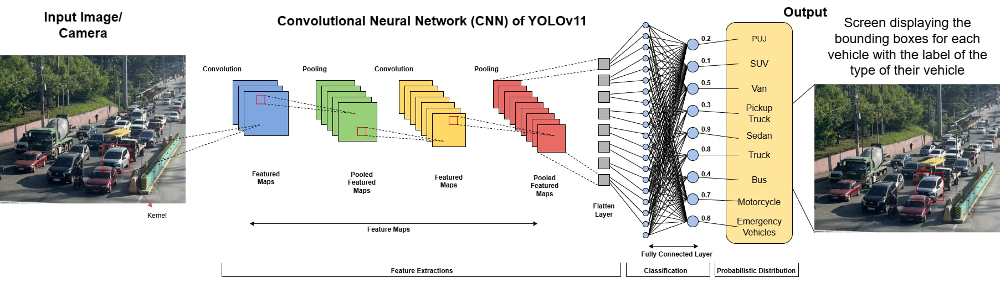

# 🚗 Aerial-View-Vehicle-Detection

> **A YOLOv11 computer vision pipeline optimized for real-time classification of land vehicles from a top-down, aerial perspective.**

[](https://www.python.org/downloads/)
[]()
[]()
[](https://opensource.org/licenses/MIT)

## 🏛️ System Architecture
This repository contains the inference logic for an aerial-perspective object detection system developed as a Grade 12 (SHS) Capstone Research project. 
*The logic flow derived from the research manuscript (illustrated in Figure 1 below) conceptualizes the multi-stage pipeline—from pre-processing localized inputs to feature extraction, multi-class categorization, and visualization.*

<p align="center">
  
  <br>
  <em>Figure 1: Conceptualized multi-stage CNN classification pipeline utilized in the research methodology.</em>
</p>

### Implementation Details
This codebase contains the technical implementation of the generalized logic flow above. Leveraging the YOLOv11 architecture for unified object detection, the system is engineered to solve the specific physical constraints of top-down occlusion, dense clustering, and small bounding-box extraction in real-time.

### Multi-Class Inference
The model is specifically trained to accurately detect and classify nine (9) distinct types of land vehicles from drone/CCTV vantage points:
1. PUJ (Public Utility Jeepney)
2. SUV
3. Van
4. Pickup Truck
5. Sedan
6. Truck
7. Bus
8. Motorcycle
9. Emergency Vehicles


## 🛡️ Data Governance & Privacy
### Sanitized Artifacts:
To ensure compliance with the Data Privacy Act of 2012 (Republic Act No. 10173), all validation batch images and prediction artifacts uploaded to this repository have been manually sanitized. Vehicle license plates and localized PII have been obfuscated prior to publication.
### Proprietary Data Acquisition & Engineering:
This pipeline does not rely on standardized open-source datasets. To meet the specific environmental and top-down occlusion constraints of the research, the entire dataset was custom-engineered. All aerial traffic feeds were physically recorded, frame-extracted, and manually annotated using [Anaconda](https://www.anaconda.com/) to ensure precise bounding-box fidelity across all 9 vehicle classes.

## ⚙️ Quick Start & Reproducibility

### Environment Setup
```bash
git clone https://github.com/matlih/Aerial-View-Vehicle-Detection.git
cd Aerial-View-Vehicle-Detection
pip install -r requirements.txt
```

### Inference Execution
Run the detection pipeline by specifying your input source. Note: Ensure your trained weights file (`best.pt`) is placed in the `weights/` directory.

Adjust the `--source` argument accordingly: 
* `--source usb0` (Standard webcam)
* `--source image.jpg` (Static photo)
* `--source video.mp4` (Pre-recorded video)

```bash
# Example: Running inference on a pre-recorded aerial feed
python src/detect.py --weights weights/best.pt --source aerial_traffic_feed.mp4

# Note for Edge Deployment: If running inference directly on a Raspberry Pi using a native Pi Camera (--source picamera0), ensure the picamera2 library is installed on your local system environment. Standard USB webcams do not require this module.
```

## 📊 Training & Evaluation Metrics
This model was evaluated and trained in a cloud GPU environment (Google Colab with an NVIDIA T4) using images at 640×640 resolution. 
The model was evaluated using four strict metrics designed for high-altitude computer vision:
* Mean Average Precision (mAP@50): 94.2%
* Precision: 92.5%
* Recall: 90.3%
* Frames Per Second (FPS): 28 FPS
* Small Object Detection Accuracy (SODA): 85.4%
